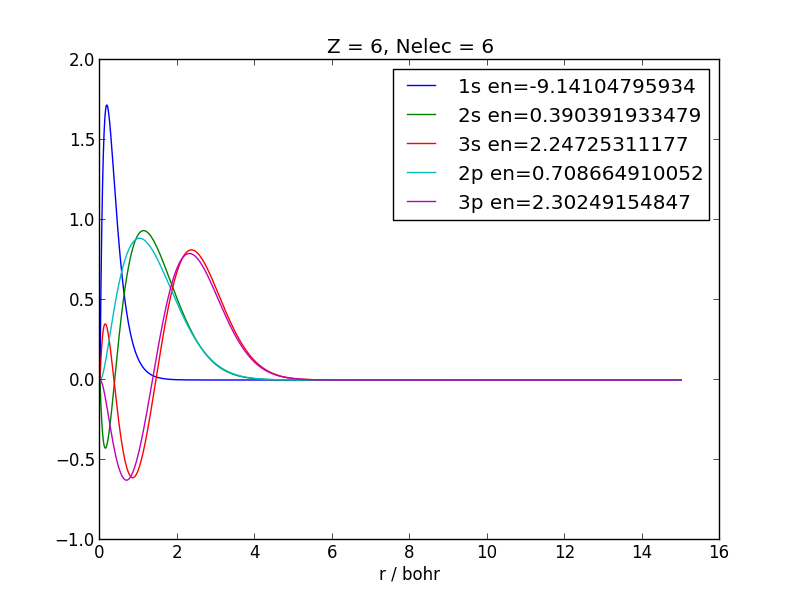
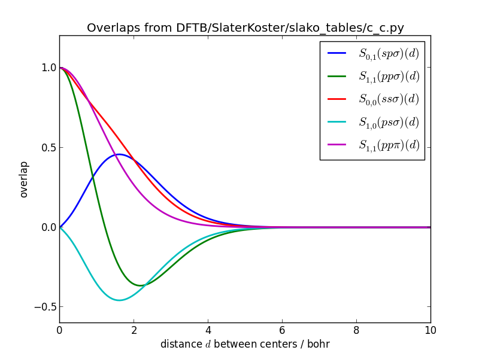
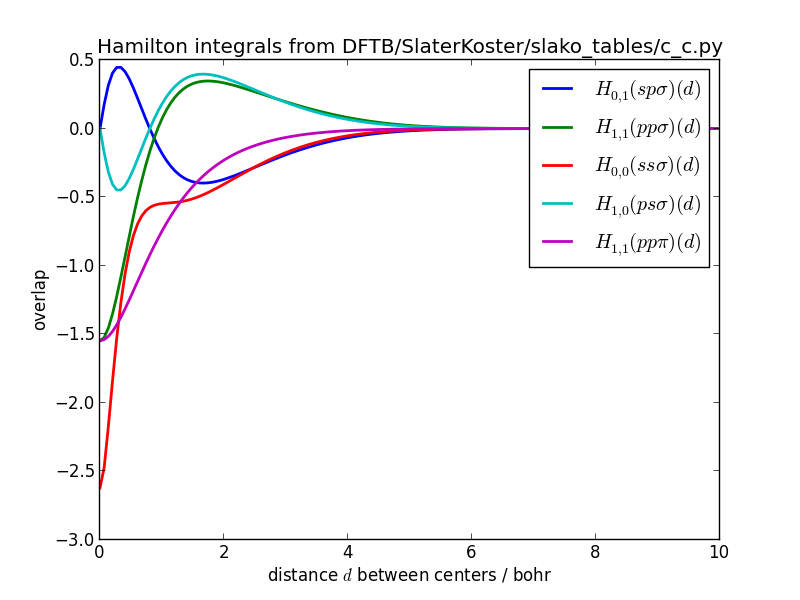
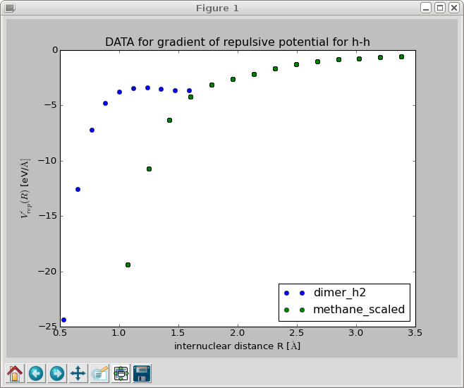
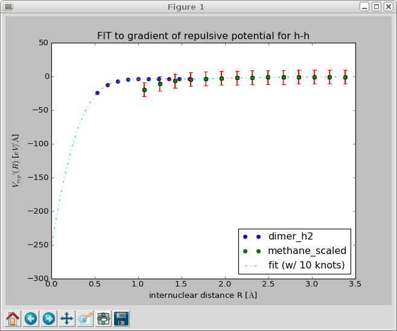
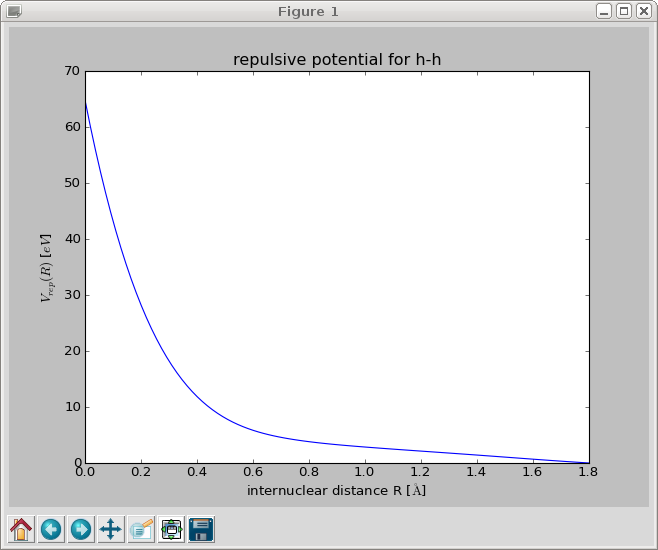
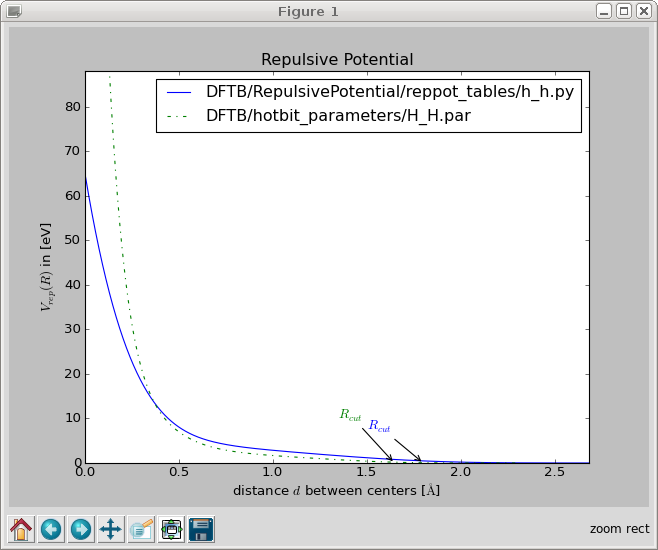
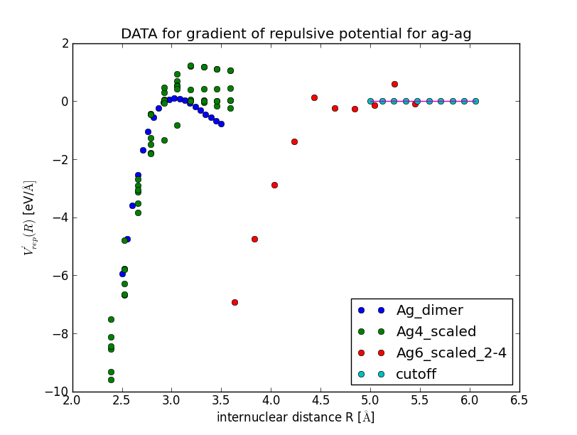
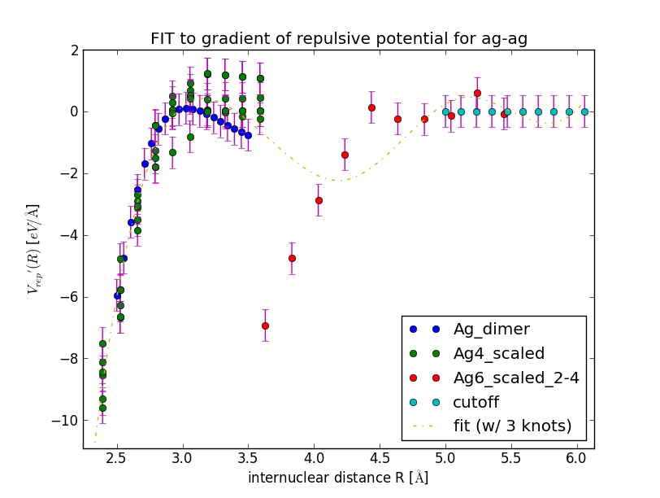
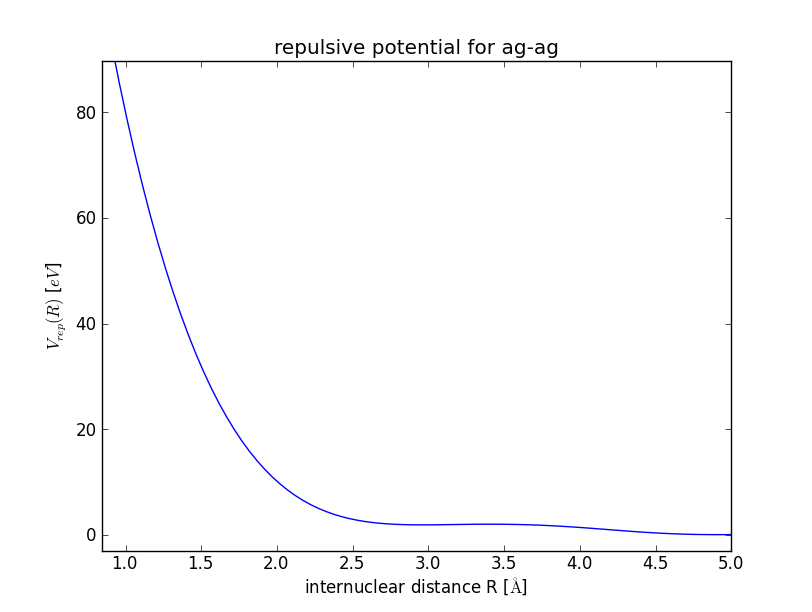

===============
Parametrization
===============

Generation of Pseudo-Atoms
==========================
DFTB employs a minimal basis of atomic valence orbitals, which are compressed by a confining potential that mimics the chemical environment. The *confinement* radius :math:`r_0` is an emirical parameter that influences all subsequent steps in the parametrization. The matrix elements of the electronic Hamiltonian and the overlap are precalculated in the basis of confined orbitals and 
are stored in the Slater-Koster format, that allows to obtain the matrix element for an arbitrary arrangement of atoms efficiently. However, in a confinement potential most Kohn-Sham eigenvalues
will be positive, which is unphysical. In order to find reasonable *Kohn-Sham energies*, which are the diagonal elements of the Hamiltonian, an atomic DFT calculation is performed for a free atom as well.

The Hubbard parameter :math:`U = IE-EA`, which models the reaction of atoms to partial charges, can be estimated from experimental or theoretical atomic ionization potentials and electron affinities.  

The default parameters can be inspected by calling:

   >>> python DFTB/Parameters.py

which produces a list of parameters for the electronic part of DFTB::

|       DFTB Parameters
|       ===============
|Atom | r0/bohr  | U/hartree
|-----|----------|----------
|  h  |  1.482   |  0.420   
|  he |  0.979   |   ---    
|  li |  4.475   |  0.175   
|  be |  3.356   |   ---    
|  b  |  2.937   |  0.295   
|  c  |  2.011   |  0.365   
|  n  |  2.482   |  0.530   
|  o  |  2.307   |  0.447   
|  f  |  1.993   |  0.515   
|  ne |  2.028   |   ---    
|  na |  5.803   |  0.169   
|  mg |  4.929   |   ---    
|  al |  4.230   |  0.204   
|  si |  3.881   |  0.249   
|  p  |  3.741   |  0.358   
|  s  |  3.671   |  0.304   
|  cl |  3.566   |  0.344   

Confined atomic orbitals reside in `DFTB/SlaterKoster/confined_pseudo_atoms/` and can be generated with

   >>> python DFTB/SlaterKoster/generate_confined_pseudoatoms.py

If you need to parametrize a new atom type, you will have to add a section to this program. I will describe how parametrize the electronic part for silver from scratch (see comments in the code)::

  def silver():
    # Eigenvalues can only be found if they are contained in
    # one of the intervals specified in energy_range.
    # If the approximate positions are known from a previous calculation
    # the search range can be narrowed down and the number of sampling points
    # can be reduced significantly to speed up the calculation.
    energy_range = list(linspace(-1500.0, -800.0, 100)) \
        + list(linspace(-800.0, -200.0, 200)) \
        + list(linspace(-200.0, -30.0, 200)) \
        + list(linspace(-30.0, -5.0, 400)) \
        + list(linspace(-5.0, 5.0, 400)) \

    Z = 47
    Nelec = 47
    # r0 is chosen to be 1.85 times the covalent radius of silver. 
    # Settings regarding the confinement and Hubbard parameters 
    # can be changed in DFTB/Parameters.py
    atomdft = PseudoAtomDFT(Z,Nelec,numerov_conv,en_conv, grid_spacing="exponential", r0=confinement_radii_byZ[Z], damping=0.6)
    # In silver the 5s is filled before 4f: [Kr] 4d^(10) 5s^1
    occupation = [occ for occ in occupation_numbers(Nelec)]
    assert occupation[-1] == (1,4-1,3)
    occupation[-1] = (1,5-1,0)
    atomdft.setOccupation(occupation)
    # I would like to include unoccupied f orbitals in minimal basis but 
    # sofar no Slater rules exist for f orbitals. So include 5p
    atomdft.setValenceOrbitals(["4d", "5s","5p"], format="spectroscopic")
    atomdft.setRadialGrid(0.000000001, 14.0, 20000)
    # The pseudo atomic DFT calculation converges better if an initial
    # guess for the density is provided.
    try:
        # Since I have already calculated silver previously, I try to import
	# this the pseudo atom from a previous calculation.
        from confined_pseudo_atoms import ag
        atomdft.initialDensityGuess((ag.r, ag.radial_density))
	# If there were no density for silver, we could start with the
	# density for copper and scale it so that the integrated density
	# equals the number of electrons in silver:
	#from confined_pseudo_atoms import cu
	#atomdft.initialDensityGuess((cu.r, float(Nelec)/float(cu.Nelec) * cu.radial_density))
    except ImportError:
        # start with zero density
        atomdft.initialDensityGuess()
    atomdft.setEnergyRange(energy_range)
    atomdft.solveKohnSham()
    fh = open(orbdir + "ag.py", "w")
    atomdft.saveSolution(fh)
    fh.close()

  # do the calculation  
  silver()

Finding the right energy range and converging the calculation can be tricky. For large atoms a correct guess of the initial charge density is important. The safest way to obtain this guess, is to 
use the converged density of an atom with a lower atomic number, for which a parametrization exists already. 
In case the *Numerov* solver for the Kohn Sham equations does not find all orbitals, it can help to change the radial grid or increase the energy range that is searched for Kohn Sham (*Shooting Method*).

In a similar way, free pseudo atoms are generated, which are stored in `DFTB/SlaterKoster/free_pseudo_atoms/`:

   >>> python DFTB/SlaterKoster/generate_free_pseudoatoms.py

Visual inspection can tell whether the obtained orbitals are reasonable:

  >>> python DFTB/SlaterKoster/plot_pseudoatoms.py DFTB/SlaterKoster/confined_pseudo_atoms/c.py

Slater-Koster Integrals
=======================
Slater-Koster integrals, from which matrix elements for arbitrary orientations of atoms can be deduced, are calculated on a double-center polar grid. This grid has to be created
only once:

  >>> python DFTB/SlaterKoster/generate_ptcgrid.py

Slater-Koster tables, which are stored in `DFTB/SlaterKoster/slako_tables/`, can be generated by:

  >>> python DFTB/SlaterKoster/generate_slakotables.py

If you would want to add silver, for which you have generated pseudo atomic orbitals, you would need to add something like::

 from confined_pseudo_atoms import h,c,n,o, ag
 # silver Ag-X                                                                                 
 slako_table(h,ag)                                                                                                                                                                                            
 slako_table(c,ag)
 slako_table(n,ag)
 slako_table(o,ag)
 slako_table(ag,ag)  

Note that the first argument to `slako_table` has to be the atom with lower Z.

The Slater-Koster tables can also be visualized:

 >>> python DFTB/SlaterKoster/plot_slakofile.py DFTB/SlaterKoster/slako_tables/c_c.py

The Slater-Koster integrals should be smooth functions.

Slater-Koster integrals of overlaps for carbon-carbon:

Slater-Koster integrals of Hamiltonian for carbon-carbon:

Repulsive Potential
===================
The repulsive potential is defined as the difference between the DFTB tight-binding potential and the true potential, which is calculated by a higher-level DFT or wavefunction method. It contains the ion-ion repulsion, the interaction between core electrons, contributions from the neglected two-electron integrals and all other exchange and correlation effects that might be absent in DFTB. 
This said, it seems unlikely that the repulsive potential can be decomposed into a sum of pairwise interactions between atomic centers.
Nevertheless, lumping all the missing interactions into an effectively repulsive potential that only acts between pairs of atoms is highly efficient from a computational point of view. 
In the following we will try to decompose the repulsive potential :math:`V_{\text{rep}}(\vec{r}_1,\vec{r}_2,\ldots,\vec{r}_N)` which depends on the positions of all :math:`N` atoms into a sum of pairwise interactions 

:math:`V_{\text{rep}} \approx \sum_{i<j} V_{ij}(\vert \vec{r}_i-\vec{r}_j \vert)`

that depend only on the relative distances between pairs of atoms. Then :math:`V_{ij}` is the repulsive potential we are looking for.
Of course such a decomposition is only approximately correct, so we need to find the best one in a least square sense.

It turns out that it is easier to extract the first derivative of the repulsive pair potential :math:`V^{(1)}_{ij}(r_{ij}) = \frac{d}{d r_{ij}} V_{ij}(r_{ij})` for different distances and perform a spline fit that allows to find the derivative for any other distance :math:`R`. The repulsive pair potential can then be found by integrating the spline function analytically from :math:`R` to a cut-off region beyond which the potential is assumed to be negligible.

:math:`V_{ij}(R) = - \int_R^{R_{cut}} V^{(1)}_{ij}(r) dr`

Fitting the repulsive potential proceeds in 4 steps:

  1. You need to select the nuclear geometries which you whish to include. To this
     end you can sample different geometries from a molecular dynamics simulation
     or create a sequence of geometries where one bond length is changed in regular
     intervals. The different geometries of the same species have to be appended
     into one xyz-file: <geometry xyz> 
  2. The repulsive force is defined as the difference between the true forces acting
     between an atom pair and those forces only due to the electronic hamiltonian as calculated
     by DFTB. Therefore we have to calculate the electronic forces for all geometries
     with DFTB and save them to a file:

    >>> python DFTB/RepulsivePotential/dftb_forces_trajectory.py <geometry xyz> <dftb forces file>

  3. Now we have to calculated the true forces at the same geometries (using some method implemented in **Gaussian 09**)

    >>> python DFTB/RepulsivePotential/gaussian_forces_trajectory.py <geometry xyz> <true forces file>

  4. Finally the cartesian force differences have to be transformed into forces acting along the 
     vector connecting the atom-pair 'atom1' and 'atom2'. 
     The repulsive potential is calculated by integrating a spline fit to the force differences. 
     The program FitForces.py reads file names for the geometries and forces from stdin. 
     It expects on each line: the name of the molecule, the xyz-file with the geometries, the xyz-file with the electronic forces by DFTB for each geometries, the xyz-file with the true forces and a weight for the data set:
 
    >>>  python DFTB/RepulsivePotential/FitForces.py atom1 atom2
    >>>     <name 1> <geometry 1> <dftb forces 1> <true forces 1> weight=<weight 1> max_error=<max. error 1>
    >>>     <name 2> <geometry 2> <dftb forces 2> <true forces 2> weight=<weight 2> max_error=<max. error 2>
    >>>  ...
      
    Only those geometries are included where the error per atom from decomposing the repulsive potential into pairwise contributions is below `max_error`.
 
    Example: If you put the lines with the file names and weights for the pair h-n into a `.lst` file you can fit the potential using
     
     >>> cat DFTB/RepulsivePotential/fitting_data/h-n/*.lst | python DFTB/RepulsivePotential/FitForces.py h n

Example: Repulsive Potential for H-H
------------------------------------
To illustrate these points we will calculate the repulsive potential for the pair hydrogen-hydrogen using the :math:`H_2` dimer with different bond lengths and 
methane structures, that were created from the equilibrium structure by multiplying all position vectors with a scale factor:

- :math:`H_2` Dimer

  The following command creates 10 dimer geometries for H-H (Z1=1, Z2=1) with bond lengths between :math:`1.0` and :math:`3.0` bohr: 

     >>> python DFTB/RepulsivePotential/create_dimer_trajectory.py h h 0.5 1.5 10 /tmp/h2.geom.xyz   

  Now we need to calculate the electronic forces (without repulsive potential) using DFTB,

     >>> python DFTB/RepulsivePotential/dftb_forces_trajectory.py /tmp/h2.geom.xyz /tmp/h2_forces.dftb.xyz

  and the 'true' forces using a higher-level method for all geometries in `h2.geom.xyz`. By default the *B3LYP* implementation in Gaussian 09 is used:

     >>> python DFTB/RepulsivePotential/gaussian_forces_trajectory.py /tmp/h2.geom.xyz /tmp/h2_forces.gauss.xyz

- Scaled methane

  Create 15 methane geometries whose size range from 0.5 to 1.9 times the original size:

     >>> python DFTB/RepulsivePotential/scale_geometry.py DFTB/test_structures/methane.xyz /tmp/methane_scaled.geom.xyz --scale_min=0.5 --scale_max=1.9 --Nscale=15  

  As for the hydrogen dimer, electronic DFTB and 'true' forces need to be calculated:

     >>> python DFTB/RepulsivePotential/dftb_forces_trajectory.py /tmp/methane_scaled.geom.xyz /tmp/methane_scaled_forces.dftb.xyz
     >>> python DFTB/RepulsivePotential/gaussian_forces_trajectory.py /tmp/methane_scaled.geom.xyz /tmp/methane_scaled_forces.gauss.xyz

Create the file '/tmp/hydrogen_containing.lst'::

 dimer_h2       /tmp/h2.geom.xyz             /tmp/h2_forces.dftb.xyz             /tmp/h2_forces.gauss.xyz             weight=1.0  max_error=0.04
 methane_scaled /tmp/methane_scaled.geom.xyz /tmp/methane_scaled_forces.dftb.xyz /tmp/methane_scaled_forces.gauss.xyz weight=0.05 max_error=0.0001

This file tells the program `FitForces.py` that you wish to include the dimer and methane geometries in the fit with weights 1.0 and 0.05.
Finally, the program `FitForces.py` tries to represent the repulsive potential as a sum over pairwise potentials:

     >>> cat /tmp/hydrogen_containing.lst | python DFTB/RepulsivePotential/FitForces.py h h --nr_knots=10

This should produce a plot of the gradient of the repulsive potential :math:`V'_{\text{H-H}}(r)` as a function of the bond length:

When you close this window, a spline is fitted to the gradient and the results is displayed in a new window. Inspect the fit closely, zoom in to check that the curve goes to negative values for :math:`R \to 0` and approaches zero from below for :math:`R \to \infty`. 

When you close this window, the repulsive gradient is integrated and the resulting repulsive potential is shown. 

The repulsive potential is stored in a file called `h_h.py` in `/tmp/`. You can change the output directory with the option `--reppot_dir`:

     >>> cat /tmp/hydrogen_containing.lst | python DFTB/RepulsivePotential/FitForces.py h h --reppot_dir="reppot_tables"

Here 'reppot_tables' is a short hand for 'DFTB/RepulsivePotential/reppot_tables/' where you should store the finished fits.

If you do not like the fit, play around with the number of knots, the cut-off radius, the weights of individual data sets or include geometries of different molecules.

You can compare your parametrization with hotbit's one:

     >>> python DFTB/RepulsivePotential/plot_reppotfile.py DFTB/RepulsivePotential/reppot_tables/h_h.py DFTB/hotbit_parameters/H_H.par

Example: Repulsive Potential for Silver Cluster
-----------------------------------------------

     >>> cat DFTB/RepulsivePotential/fitting_data/ag-ag/silver_containing.lst | python DFTB/RepulsivePotential/FitForces.py ag ag --Rcut=5.0 --nr_knots=3 --reppot_dir="reppot_tables"

