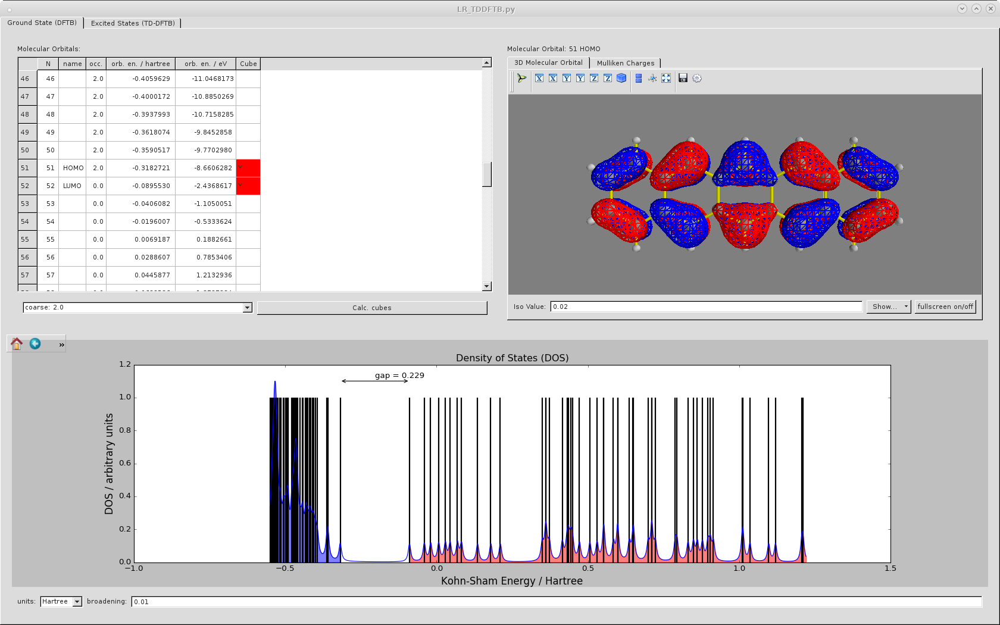
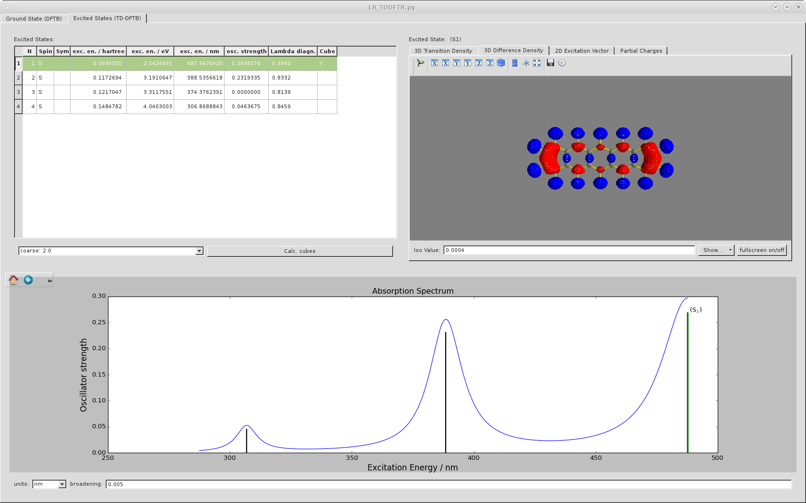
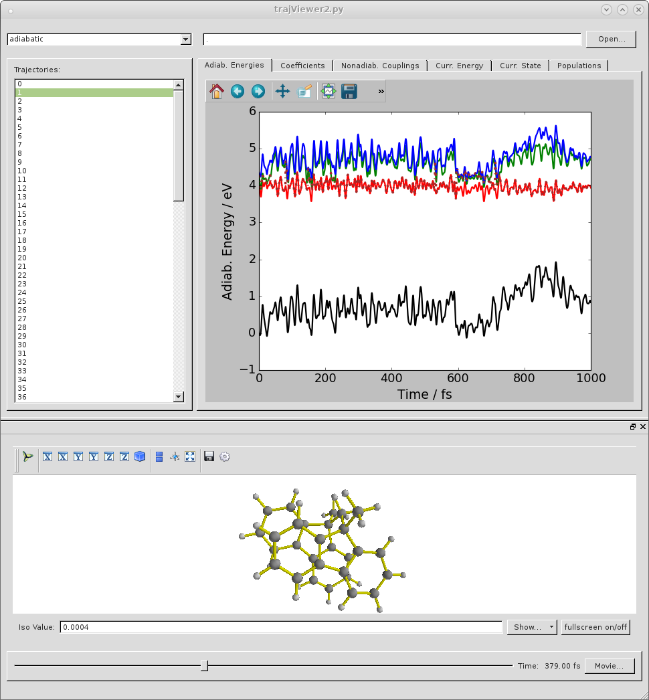
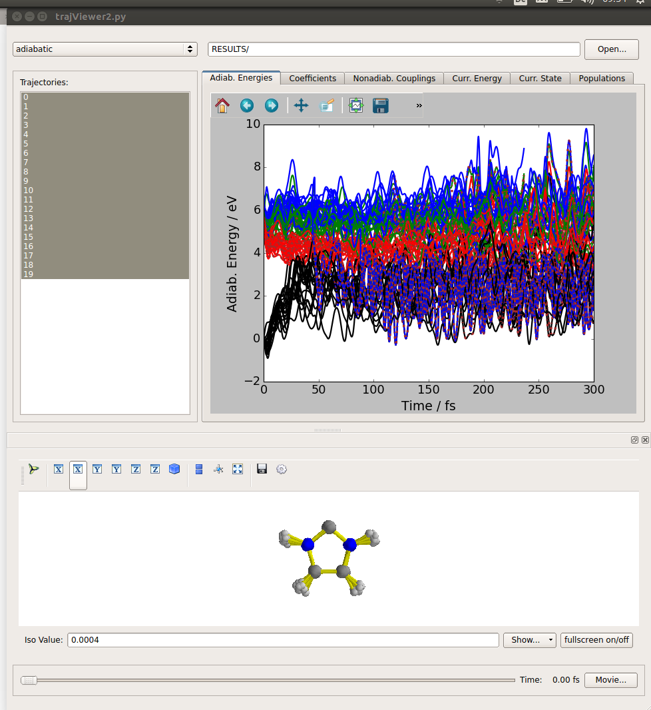
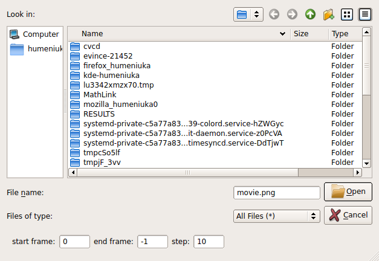

DFTBaby - Software for lc-TD-DFT(B) calculations and non-adiabatic dynamics simulations
=======================================================================================

Tight-binding DFT is a semiempirical electronic structure method based on DFT. 

Features
--------
+ Electronic Parametrization
    - Pseudo-orbitals can be generated from atomic DFT calculations
      using non-hybrid functionals from the **libxc**-library
    - Slater-Koster files for the hamiltonian, the overlap, and dipoles
      can be generated from the pseudo-orbitals
+ Repulsive Potentials
    - scaled repulsive potentials of **Hotbit**
+ DFTB
    - long-range correction
    - Grimme's dispersion correction (experimental)
+ TD-DFTB
    - excited states with and without long-range correction
    - analytical excited state gradients
+ QM/MM
    - QM part treated with TD-DFTB, MM part with UFF of Gaussian 09
    - QM/MM calculations of molecular crystals (with periodic boundary conditions) using
      rudimentary implementation of the DREIDING force field
+ Analysis
    - cube files for molecular orbitals and transition and difference densities of excited states
+ Non-adiabatic Dynamics
    - surface hopping
    - electronic coefficients are integrated in the locally diabatic basis

References
----------
 [1] Humeniuk,A. Mitric,R. Long-range correction for tight-binding TD-DFT. [J. Chem. Phys., 143, 134120 (2016)](http://dx.doi.org/10.1063/1.4931179)
 [2] Humeniuk,A. Mitric,R. DFTBaby: A software package for non-adiabatic molecular dynamics simulations based on long-range corrected tight-binding TD-DFT(B). (https://arxiv.org/abs/1703.04049)
Installation
------------

You can find the latest version of DFTBaby on its download page

 * [RELEASES](../RELEASES/)

After downloading the release archive the DFTB module can be installed locally by typing

~~~bash
$ tar -xvf DFTBaby-#.#.#.tar.gz
$ cd DFTBaby-#.#.#/
$ python setup.py install --user
~~~

You will find more information in the `README.txt` located in the top folder.
If the installation succeeds you should be able to execute

~~~bash
$ DFTB2.py --help
~~~

All programs in the DFTBaby package come with a `--help` option that shows all the available command line options
with a short explanation. The options can be passed on the command line or can be placed in a configuration file
called `dftbaby.cfg` in the current directory, for example:

~~~python
[DFTBaby]
# turn on long-range correction
long_range_correction=1

verbose=0

[SurfaceHopping]
# ... options for dynamics ...
~~~

A full list of all options can be found [here](mdwiki.html#!WIKI/options.md).

Alternatively, **DFTBaby** can be installed by adding the folder `DFTBaby-####` to the `PYTHONPATH`
environment variable. The subfolders `DFTB/`, `DFTB/Analyse`, `DFTB/Modeling`, `DFTB/Formats`, `DFTB/Dynamics`, `DFTB/Dynamics/Analyse` and `DFTB/Dynamics/Analyse/Viewer`
should be added to the `PATH` environment variable. This setup has the advantage that you
can modify the code and use it without reinstalling it repeatedly.
The script `dftbaby_env.sh` contains the necessary lines of code to set those environment
variables and can be sourced from the `.bashrc` profile.

If you are using environment modules you can use the file `dftbaby.modulefile` as a template. 

In some cases you will have to compile the extensions for the architecture of your machine
with **f2py**:
~~~bash
  cd DFTB/extensions/
  make clean
  make
~~~

Programs
--------
DFTBaby provides the module DFTB that can be imported from python. In addition
the following programs (among other scripts) can be called directly from the command line:

 * `DFTB2.py`          - only ground state calculation, MOs
 * `LR_TDDFTB.py`      - ground and excited state calculations, gradients
 * `optimize.py`       - optimizes geometries on ground and excited states
 * `SurfaceHopping.py` - runs non-adiabatic molecular dynamics

Graphical Analysis Tool
-----------------------
The results of a TD-DFTB calculation can be visualized graphically. To start the graphical user interface
at the end of a calculation it is enough to add the option `--graphical=1` when calling `LR_TDDFTB.py`.
At the moment it is not possible to separate the calculation and visualization steps, since intermediate results are not stored on disk.

The graphical interface relies on the **PyQt** and **mayavi** packages for displaying menus, molecular structures and volumetric data. 
The easiest way to install the required packages is to download Enthought's [Canopy distribution](https://www.enthought.com/products/canopy/)
and install **mayavi**.

After launching the graphical interface a window with two taps appears:

# Ground State (DFTB):#

 

 + This tab contains a list of the molecular orbitals, with their energies and occupation
   numbers. To visualize them, select one or more orbitals in the list and click the
   _Calc. cubes_ button. This will generate cube files for the selected orbitals and display
   the currently selected orbital in the viewer on the right (__3D Molecular Orbital__).
   A red marker next to the orbital indicates that a cube file is available for this
   orbital and can be shown by clicking it.

 + Orbitals can also be selected by clicking the corresponding stick in the __Density of States__ window below.

 + In the orbital viewer, the options _Show->isosurface_, _Show->X cut plane_, etc., 
   allow you to show or hide the surface and to display contour plots of the orbitals in the x-, y- and z-planes. 
   These planes can be moved or rotated by clicking and dragging.

#Excited States (TD-DFTB):#

 

 + This tab contains a table of the excited states, and viewer for showing
   and a plot of the absorption spectrum. You first need to create cube files 
   by selecting the desired states in the table and clicking 'Calc. cubes' 
   before you can inspect the transition density and difference density.

 + The viewer windows on the right contain 4 tabs:

   * __3D transition density__: 

   * __3D difference density__: difference between the electron density in the excited state and the ground state

   * __2D Excitation Vector__: 
     Visualizes the weights of the single excitations in the total wavefunction. 
     The color of the pixel with coordinates (o,v) encodes the amplitude of the 
     excitation from the occupied orbital o to the virtual orbital v in the wavefunction
     of the selected excited state. You can inspect the amplitude of a single transition
     by clicking on a pixel. The icon '>>' in the upper left corner of the plot gives
     access to a menu for zooming, saving the plot, etc.

   * __Partial Charges__: 
     Mulliken charges in the excited state. If there are several disconnected fragments, 
     enabling the option _Show->frag.charges_ will display the sum of the charges for each fragment.
     To see the total charges per fragment you might want to display the atomic charges 
     by unselecting the _Show->charges_ option.

Limitations and Bugs
--------------------
The following known limitations should be kept in mind when using (lc)-TD-DFTB:

- DFTB uses a minimal basis set of valence orbitals. Being numerically exact
  atomic orbitals obtained from a DFT calculations, the pseudo-orbitals are much better
  than for instance, STO-3G basis functions. However, Rydberg states, which are frequent
  in organic conjugated molecules, cannot be described in this way.

- The Coulomb interaction between density fluctuations around the neutral reference density
  is calculated using the monopole approximation. In reality, the charge fluctuations around an atom
  are not spherically symmetric. In my experience the monopole approximation leads to occupied Kohn-Sham 
  orbitals that are too high in energy. Excitations from these orbitals to unoccupied ones produce spurious low-lying
  states, that are dark.
  Adding the interaction between Mulliken monopoles and dipoles should in principle fix this problem, however
  the Mulliken dipoles are too large and lead to SCF convergence problems.

- same limitations as full lc-TD-DFT: conical intersections between S1 and S0 have the wrong topology.

- only closed shell Singlet states can be calculated

Not all features work as expected and probably there are still some bugs. If you have any doubt, I am happy to try answer your questions. Please contact A. Humeniuk at the [theoretical chemistry group of Prof. Mitric](http://www.phys-chemie.uni-wuerzburg.de/en/arbeitsgruppen/prof_dr_roland_mitric/mitarbeiter/).

Short Manual
------------
Below the usage of the program is illustrated by a few simple calculations.

Ground state calculations
-------------------------
The program `DFTB2.py` constructs the semiempirical DFTB2 hamiltonian from Slater-Koster files 
and equilibrates the partial charges self-consistently. The only command line argument expected
is the name of a file with the molecular geometry in the xyz-format.

Create the file `benzene.xyz` with the following geometry:
~~~
12
benzene
H 0.000000 2.484212 0.000000
H 0.000000 -2.484212 0.000000
H 2.151390 1.242106 0.000000
H -2.151390 -1.242106 0.000000
H -2.151390 1.242106 0.000000
H 2.151390 -1.242106 0.000000
C 0.000000 1.396792 0.000000
C 0.000000 -1.396792 0.000000
C 1.209657 0.698396 0.000000
C -1.209657 -0.698396 0.000000
C -1.209657 0.698396 0.000000
C 1.209657 -0.698396 0.000000
~~~

Now execute the DFTB2.py program
~~~bash
	$ DFTB2.py benzene.xyz | tee /tmp/dftb.out
~~~

For each SCF iteration the program will print the Mulliken charges and energies of the molecular orbitals
~~~
...
     *******************
      * Iteration: 37 *
      *******************
  Convergence
  ===========
relative change: 8.417431e-11
  Electronic Energies
  ===================
band structure energy E_bs:  -13.0260674 hartree      -354.4574798 eV
Coulomb energy E_coulomb  :    0.0008605 hartree         0.0234163 eV
long range HF-x E_x       :   -1.0064646 hartree       -27.3873081 eV
total electronic energy   :  -14.0316715 hartree      -381.8213716 eV
repulsion energy          :    0.8358768 hartree        22.7453747 eV
total energy              :  -13.1957947 hartree      -359.0759969 eV
HOMO-LUMO gap             :    0.3818691 hartree        10.3911927 eV
  Orbital Energies
  ================
     0:   -0.5341218 hartree       -14.5342008 eV  (2.000 e)
     1:   -0.5328525 hartree       -14.4996595 eV  (2.000 e)
     2:   -0.5328096 hartree       -14.4984937 eV  (2.000 e)
     3:   -0.5263937 hartree       -14.3239083 eV  (2.000 e)
     4:   -0.5263200 hartree       -14.3219007 eV  (2.000 e)
     5:   -0.5225932 hartree       -14.2204908 eV  (2.000 e)
     6:   -0.4904442 hartree       -13.3456711 eV  (2.000 e)
     7:   -0.4775354 hartree       -12.9944059 eV  (2.000 e)
     8:   -0.4741544 hartree       -12.9024028 eV  (2.000 e)
     9:   -0.4588021 hartree       -12.4846469 eV  (2.000 e)
    10:   -0.4587841 hartree       -12.4841559 eV  (2.000 e)
    11:   -0.4255102 hartree       -11.5787278 eV  (2.000 e)
    12:   -0.4255102 hartree       -11.5787256 eV  (2.000 e)
    13:   -0.3848252 hartree       -10.4716322 eV  (2.000 e)
    14:   -0.3848233 hartree       -10.4715806 eV  (2.000 e)
    15:   -0.0029542 hartree        -0.0803879 eV  (0.000 e)
    16:   -0.0029522 hartree        -0.0803333 eV  (0.000 e)
    17:    0.1380796 hartree         3.7573385 eV  (0.000 e)
    18:    0.2853296 hartree         7.7642163 eV  (0.000 e)
    19:    0.3334102 hartree         9.0725563 eV  (0.000 e)
    20:    0.3334376 hartree         9.0733023 eV  (0.000 e)
    21:    0.4609968 hartree        12.5443657 eV  (0.000 e)
    22:    0.4775578 hartree        12.9950144 eV  (0.000 e)
    23:    0.4776308 hartree        12.9970018 eV  (0.000 e)
    24:    0.7182194 hartree        19.5437533 eV  (0.000 e)
    25:    0.7184974 hartree        19.5513173 eV  (0.000 e)
    26:    0.7488216 hartree        20.3764803 eV  (0.000 e)
    27:    0.7492221 hartree        20.3873784 eV  (0.000 e)
    28:    0.9148878 hartree        24.8953737 eV  (0.000 e)
    29:    1.0419351 hartree        28.3525094 eV  (0.000 e)
  Mulliken Charges   (Partial Charges)
  NOTE: charges are in units of e-!
  =========================================================================
    h-0     : 0.968	(-0.032)
    h-1     : 0.968	(-0.032)
    h-2     : 0.968	(-0.032)
    h-3     : 0.968	(-0.032)
    h-4     : 0.968	(-0.032)
    h-5     : 0.968	(-0.032)
    c-6     : 4.032	(+0.032)
    c-7     : 4.032	(+0.032)
    c-8     : 4.032	(+0.032)
    c-9     : 4.032	(+0.032)
    c-10    : 4.032	(+0.032)
    c-11    : 4.032	(+0.032)
  =========================================================================
  sum of charges        : +30.000
  sum of partial charges: +0.000

!!! CONVERGED after 38 iterations (relative change = 8.42e-11 < 1.00e-10 = threshold)!!!
TOTAL ENERGY OF STRUCTURE 0              :  -13.1957947 hartree      -359.0759969 eV
~~~

It is important to note that the counting of the MOs starts at 0, therefore the HOMO is the orbital #14 and not #15 as one
would expect for a molecule with 30 valence electrons. Also note that Mulliken charges are given in units of the electronic charge, 
so a partial Mulliken charge of -0.032 on the hydrogens means that they are actually slightly positively charged as compared
to the carbon atoms. 

If you wish to also see the MO coefficients in each iteration, you should run
~~~bash
$ DFTB2.py benzene.xyz --verbose=2 | tee /tmp/dftb.out
~~~

~~~
...
           |    MO10   |    MO11   |    MO12   |    MO13   |    MO14   |    MO15   |    MO16   |    MO17   |    MO18   |    MO19   |
------------------------------------------------------------------------------------------------------------------------------------
 en. (a.u.)|  -0.4588  |  -0.4255  |  -0.4255  |  -0.3848  |  -0.3848  |  -0.0030  |  -0.0030  |   0.1381  |   0.2853  |   0.3334  |
    occ.   |   2.0000  |   2.0000  |   2.0000  |   2.0000  |   2.0000  |   0.0000  |   0.0000  |   0.0000  |   0.0000  |   0.0000  |
------------------------------------------------------------------------------------------------------------------------------------
   h-0 1s  |  -0.0611  |   0.2747  |   0.0728  |   0.0000  |   0.0000  |   0.0000  |   0.0000  |   0.0000  |  -0.4241  |  -0.5476  |
   h-1 1s  |   0.0611  |   0.2747  |   0.0728  |  -0.0000  |   0.0000  |   0.0000  |   0.0000  |   0.0000  |  -0.4241  |   0.5476  |
   h-2 1s  |   0.1668  |  -0.2004  |   0.2014  |   0.0000  |  -0.0000  |  -0.0000  |   0.0000  |  -0.0000  |  -0.4241  |  -0.3997  |
   h-3 1s  |  -0.1668  |  -0.2004  |   0.2014  |   0.0000  |  -0.0000  |  -0.0000  |   0.0000  |   0.0000  |  -0.4241  |   0.3997  |
   h-4 1s  |  -0.2271  |  -0.0743  |  -0.2742  |  -0.0000  |  -0.0000  |   0.0000  |  -0.0000  |   0.0000  |  -0.4242  |  -0.1481  |
   h-5 1s  |   0.2271  |  -0.0743  |  -0.2742  |  -0.0000  |   0.0000  |   0.0000  |  -0.0000  |  -0.0000  |  -0.4242  |   0.1481  |
   c-6 2s  |   0.0357  |  -0.0023  |  -0.0006  |   0.0000  |   0.0000  |   0.0000  |   0.0000  |   0.0000  |   0.2200  |   0.1739  |
  c-6 2py  |   0.0937  |  -0.2550  |  -0.0675  |   0.0000  |   0.0000  |   0.0000  |   0.0000  |   0.0000  |  -0.2732  |  -0.4701  |
  c-6 2pz  |  -0.0000  |   0.0000  |  -0.0000  |  -0.1448  |  -0.5192  |   0.1560  |   0.6130  |   0.4889  |  -0.0000  |  -0.0000  |
  c-6 2px  |   0.1267  |  -0.0807  |   0.3050  |   0.0000  |  -0.0000  |   0.0000  |  -0.0000  |   0.0000  |  -0.0000  |  -0.0432  |
   c-7 2s  |  -0.0357  |  -0.0023  |  -0.0006  |  -0.0000  |  -0.0000  |  -0.0000  |   0.0000  |  -0.0000  |   0.2200  |  -0.1739  |
  c-7 2py  |   0.0937  |   0.2550  |   0.0675  |  -0.0000  |   0.0000  |   0.0000  |  -0.0000  |   0.0000  |   0.2732  |  -0.4701  |
  c-7 2pz  |  -0.0000  |  -0.0000  |   0.0000  |   0.1448  |   0.5192  |   0.1560  |   0.6130  |  -0.4889  |  -0.0000  |   0.0000  |
  c-7 2px  |   0.1267  |   0.0807  |  -0.3050  |  -0.0000  |   0.0000  |  -0.0000  |  -0.0000  |  -0.0000  |   0.0000  |  -0.0432  |
   c-8 2s  |  -0.0978  |   0.0017  |  -0.0017  |   0.0000  |  -0.0000  |  -0.0000  |   0.0000  |  -0.0000  |   0.2202  |   0.1270  |
  c-8 2py  |  -0.2082  |   0.2867  |   0.0991  |  -0.0000  |   0.0000  |   0.0000  |  -0.0000  |  -0.0000  |  -0.1367  |  -0.2752  |
  c-8 2pz  |  -0.0000  |   0.0000  |  -0.0000  |   0.3772  |  -0.3851  |   0.4528  |  -0.4416  |  -0.4889  |   0.0000  |   0.0000  |
  c-8 2px  |  -0.1754  |   0.0493  |  -0.2732  |  -0.0000  |   0.0000  |   0.0000  |  -0.0000  |  -0.0000  |  -0.2365  |  -0.2372  |
   c-9 2s  |   0.0978  |   0.0017  |  -0.0017  |   0.0000  |  -0.0000  |  -0.0000  |  -0.0000  |   0.0000  |   0.2202  |  -0.1270  |
  c-9 2py  |  -0.2082  |  -0.2867  |  -0.0991  |  -0.0000  |   0.0000  |  -0.0000  |   0.0000  |  -0.0000  |   0.1367  |  -0.2752  |
  c-9 2pz  |  -0.0000  |  -0.0000  |   0.0000  |  -0.3772  |   0.3851  |   0.4528  |  -0.4416  |   0.4889  |   0.0000  |  -0.0000  |
  c-9 2px  |  -0.1754  |  -0.0493  |   0.2732  |   0.0000  |  -0.0000  |  -0.0000  |  -0.0000  |  -0.0000  |   0.2365  |  -0.2372  |
  c-10 2s  |   0.1339  |   0.0006  |   0.0023  |  -0.0000  |  -0.0000  |   0.0000  |  -0.0000  |   0.0000  |   0.2204  |   0.0471  |
  c-10 2py |   0.2039  |   0.2981  |   0.0557  |   0.0000  |   0.0000  |   0.0000  |  -0.0000  |   0.0000  |  -0.1365  |  -0.2047  |
  c-10 2pz |  -0.0000  |  -0.0000  |   0.0000  |  -0.5221  |  -0.1342  |  -0.6088  |  -0.1714  |  -0.4889  |   0.0000  |   0.0000  |
  c-10 2px |  -0.2855  |   0.0924  |  -0.2617  |  -0.0000  |  -0.0000  |   0.0000  |  -0.0000  |  -0.0000  |   0.2365  |   0.0286  |
  c-11 2s  |  -0.1339  |   0.0006  |   0.0023  |  -0.0000  |   0.0000  |   0.0000  |   0.0000  |   0.0000  |   0.2204  |  -0.0471  |
  c-11 2py |   0.2039  |  -0.2981  |  -0.0558  |   0.0000  |  -0.0000  |   0.0000  |   0.0000  |   0.0000  |   0.1365  |  -0.2047  |
  c-11 2pz |  -0.0000  |   0.0000  |  -0.0000  |   0.5221  |   0.1342  |  -0.6088  |  -0.1714  |   0.4889  |   0.0000  |  -0.0000  |
  c-11 2px |  -0.2855  |  -0.0924  |   0.2617  |   0.0000  |  -0.0000  |  -0.0000  |   0.0000  |  -0.0000  |  -0.2365  |   0.0286  |
...
~~~

Since for larger molecules the output can be huge it should be redirected to a file in the scratch or tmp directory.
To check the progress in the SCF-convergence type

~~~
$ grep "relative change" /tmp/dftb.out 
~~~

Visualizing Orbitals
====================
The converged Kohn-Sham orbitals can be written to a file that can be visualized using **Molden**.

~~~bash
$ DFTB2.py benzene.xyz --molden_file=benzene.molden --verbose=0 
$ molden benzene.molden
~~~

Since DFTB uses numerical atomic orbitals, while Molden requires Gaussian-type orbitals, the orbitals are converted into the STO-6G basis. Also note that molden starts counting orbitals from 1!
To visualize the exact orbitals, you should write the orbitals of interest to cube-files:

The command
~~~bash
$ DFTB2.py benzene.xyz --cubedir=. --points_per_bohr=5.0 --verbose=0 
~~~
will create the cube files 'benzene_HOMO.cube' and 'benzene_LUMO.cube'. For an explanation on how to write out orbitals other than the frontier orbitals, add the --help option:

~~~bash
$ DFTB2.py benzene.xyz --cubedir=. --points_per_bohr=5.0 --verbose=0 --help
~~~
and search for the relevant section

~~~
 Cube-Files:
    --cubedir=CUBEDIR    directory where cube files are stored [default: none]
    --cube_orbitals=CUBE_ORBITALS
                         list indeces of molecular orbitals which should be
                        saved to a cube file, e.g. '[0,1,2]' (if None, the
                        HOMO-1, HOMO, LUMO and LUMO+1 are saved) [default: []]
    --points_per_bohr=POINTS_PER_BOHR
                         resolution of grid for cube files [default: 2.0]
    --cube_threshold=CUBE_THRESHOLD
                         atomic orbitals with coefficients below
                        threshold*(largest coefficient) are neglected when
                        evaluating MO amplitudes on a cube grid.,  [default:
                        0.001]
~~~

To avoid writing long sequences of command line arguments, you can put all options into a file `dftbaby.cfg`:
~~~python
[DFTBaby]
cubedir=.
points_per_bohr=5.0
verbose=0
~~~

Now executing
~~~
$ DFTB2.py benzene.xyz
~~~
in the same folder where `dftbaby.cfg` is located will also create the desired cube files.

SCF-Convergence Issues
======================
The most common problem encountered is that the SCF calculation does not converge. To solve this issue you should

* check that the input geometry is reasonable. A missing hydrogen or a fragmented molecule can be the culprits. Also if you happen to hit a conical intersection between the ground and an excited state, the SCF calculation can hop back and forth between two solutions.

* inspect the HOMO-LUMO gap which is printed at each iteration. If the HOMO-LUMO gap drops below a threshold, the virtual orbitals are shifted up which usually resolves the issue automatically. 
* Keep in mind, that convergence issues point to a serious problem with using the DFTB method for the particular molecule. Even is you can enforce convergence by using some combination of level-shifting, DIIS and linear-mixing of the densities at the early stages of the SCF-cycle (see the section 'SCF-Convergence' in the help menue), this solution is probably not reasonable. 

Closed Shell Ions
=================
To compute the electronic structure of a closed-shell ion (cation or anion) the charge has to be set inside the xyz-file on the comment line. 
For the Ag5+ cation the xyz-file could be:
~~~
    5
charge=+1
Ag    -5.106663     2.600666    -0.719950
Ag    -3.294714     3.534874     0.875566
Ag    -3.035389     1.106012    -0.096583
Ag    -2.540480    -1.332515     0.751398
Ag    -1.196625    -0.380320    -1.246348
~~~

Excited states
--------------
Excited state calculations are performed with the program `LR_TDDFTB.py`, which first performs an SCF-calculation and then solves the linear response equations of TD-DFTB. By default, the full TD-DFTB matrix is constructed and diagonalized. While this is feasible for small molecules, for larger ones you should use the Davidson algorithm which iteratively determines the lowest excited states only. The iterative diagonalization is requested by adding the option `--nstates` with the number of states.

To compute the lowest 6 states of benzene type:
~~~bash
$ LR_TDDFTB.py benzene.xyz --nstates=6 --diag_conv=1.0e-8
~~~

At the end of the output you should find a table with a summary of the properties of the excited states:
~~~
           Excited States
           ==============
     Spn         exc. en. /hartree      exc. en. / eV   exc. en.y / nm   osc. strength             dominant contrib.               en_KS / eV      transition dipole [TDx TDy TDz]   /\ diagn.
    1 S    :    0.1696006 hartree      4.6150703 eV    268.6508244 nm     0.0000000         14->15(+7.069e-01),13->16(-7.069e-01)  10.3912       [-0.0001003 -0.0000575 -0.0000000]  0.8111
    2 S    :    0.1713666 hartree      4.6631237 eV    265.8823805 nm     0.0000000         13->15(+7.022e-01),14->16(+7.022e-01)  10.3912       [+0.0000068 -0.0000062 -0.0000000]  0.9997
    3 S    :    0.2140494 hartree      5.8245820 eV    212.8637613 nm     0.0013724         12->15(-7.039e-01),11->16(-6.998e-01)  11.4983       [+0.0000000 +0.0000000 +0.0980699]  0.9160
    4 S    :    0.2152690 hartree      5.8577711 eV    211.6577128 nm     0.0000000         12->16(+5.548e-01),11->15(+5.502e-01)  11.4984       [+0.0000000 +0.0000000 -0.0000478]  0.8752
    5 S    :    0.2152692 hartree      5.8577753 eV    211.6575605 nm     0.0000000         11->16(-5.540e-01),12->15(+5.509e-01)  11.4984       [-0.0000000 -0.0000000 -0.0000580]  0.8920
    6 S    :    0.2165301 hartree      5.8920866 eV    210.4250174 nm     0.0000000         11->15(+7.006e-01),12->16(-6.946e-01)  11.4983       [-0.0000000 -0.0000000 -0.0001795]  0.8508
~~~

* The first columns indicate the spin (S = Singlet, T = Triplet) and symmetry (if available)

* The next columns give the excitation energy in different units (Hartree, eV and nm) followed by the oscillator strength.

* The column __dominant contrib.__ lists the dominant single excitations present in an excited state with their phases. Note that orbitals are counted from 0, again. So 14->15 is a HOMO->LUMO excitation.

* The column __en_KS__ lists the energy difference between the Kohn-Sham orbital energies of the dominant excitation. If this value is equal to the excitation energy, the coupling matrix in TD-DFTB did not shift the energy of this excitation.

* The column __transition dipole__ shows the transtion dipole vector.

* The last column contains a metric for detecting charge transfer states, a value close to 0 (< 0.3) indicates a charge transfer state, while a value close to 1.0 is indicative of a valence excitation.

You can save the excitation energies and oscillator strengths as a table to a file with the option `--spectrum_file`

~~~bash
$ LR_TDDFTB.py benzene.xyz --nstates=6 --spectrum_file=benzene.spec
~~~

Symmetry
========
The symmetry of excited states can be determined by looking at the transformation properties of the transition densities and comparing the sign changes with the character tables. This only works for non-degenerate representations. The following symmetry groups can be detected: C1, Cs, C2v, C2h, D2h, D3h, D4h, D6h, D2d. 
Using symmetry does not speed up the calculation, quite the opposite, also the molecule will be reoriented.

~~~bash
$ LR_TDDFTB.py benzene.xyz --nstates=6 --diag_conv=1.0e-8 --use_symmetry=1
~~~

~~~
...
           Excited States
           ==============
     Spn D6h     exc. en. /hartree      exc. en. / eV   exc. en.y / nm   osc. strength             dominant contrib.               en_KS / eV      transition dipole [TDx TDy TDz]   /\ diagn.
    1 S B1u:    0.1696006 hartree      4.6150703 eV    268.6508244 nm     0.0000000         14->15(-7.069e-01),13->16(-7.069e-01)  10.3912       [+0.0000000 -0.0001003 +0.0000575]  0.8111
    2 S B2u:    0.1713666 hartree      4.6631237 eV    265.8823805 nm     0.0000000         13->15(+7.022e-01),14->16(-7.022e-01)  10.3912       [-0.0000000 +0.0000068 +0.0000097]  0.9997
    3 S A2u:    0.2140494 hartree      5.8245820 eV    212.8637613 nm     0.0013725         12->15(-7.039e-01),11->16(-6.998e-01)  11.4983       [+0.0980732 -0.0000000 +0.0000000]  0.9160
    4 S   ?:    0.2152690 hartree      5.8577711 eV    211.6577128 nm     0.0000000         12->16(-5.548e-01),11->15(-5.502e-01)  11.4984       [+0.0000478 -0.0000000 +0.0000000]  0.8752
    5 S   ?:    0.2152692 hartree      5.8577753 eV    211.6575605 nm     0.0000000         11->16(-5.540e-01),12->15(+5.509e-01)  11.4984       [-0.0000580 +0.0000000 -0.0000000]  0.8920
    6 S A1u:    0.2165301 hartree      5.8920866 eV    210.4250174 nm     0.0000000         11->15(-7.006e-01),12->16(+6.946e-01)  11.4983       [+0.0001795 -0.0000000 +0.0000000]  0.8508
~~~
Note how the symmetry of the degenerate 4th and 5th states could not be determined.

Active Space
============
For large molecules or if computations for similar geometries have to be performed many times as in an MD simulation, 
a significant speed-up can be achieved by restricting the excitations to a space of active orbitals.
This does not change results, if the lowest excited states are contained
in a subspace of excitations around the HOMO-LUMO gap. 
As an extreme example consider S1 state of benzene. 

~~~bash
$ LR_TDDFTB.py benzene.xyz --nstates=1
~~~

The section __Active Space__ in the output informs you that you could have limited the active
space to only 4 frontier orbitals:
~~~
  Active Space
  ============
State   1: contains excitations from window  occ  13 - virt  16

The suggested active space for describing the lowest 1 states consists of
the highest 2 occupied and the lowest 2 virtual orbitals.
This active space accounts for 0.9999900 of the total probability for each state.
You should check that the active space contains all neighbouring (almost) degenerate orbitals.
Dimension of active space: 4
Dimension of  full  space: 225
~~~

In subsequent calculations you can then restrict the active space to excitations from the highest 2 occupied to the lowest 2 unoccupied orbitals:
~~~bash
$ LR_TDDFTB.py benzene.xyz --nstates=1 --nr_active_occ=2 --nr_active_virt=2
~~~

It is important to check that the active space is large enough, otherwise the results are completely arbitrary.

Visualizing Transition densities
================================
Transition densities can be saved to cube files.
The following command saves the transition densities for the lowest 3 states as cube files in the current directory:
~~~bash
$ LR_TDDFTB.py benzene.xyz --nstates=6 --cubedir=. --cube_states="[1,2,3]"
~~~

Natural Transition Orbitals (NTOs)
==================================
Natural transition orbitals can be saved in the molden format.

The command
~~~bash
$ LR_TDDFTB.py benzene.xyz --nstates=6 --nto_states="[1,2]" 
~~~
creates the files `NTO_1.molden` and `NTO_2.molden` with the NTOs for the 1st and 2nd excited states.
The NTOs occur in pairs with the same eigenvalue, i.e. `(HOMO,LUMO), (HOMO-1,LUMO+1), ...`. The eigenvalues
of all pairs should sum to 1, as each eigenvalue indicates the weight of the respective orbital 
transition.  

Analytic gradients
==================
Analytic gradients can be calculated using the auxilary functional method developed by Furche.

The following command computes the gradient on the S1 state:
~~~bash
LR_TDDFTB.py benzene.xyz --nstates=6 --gradient_state=1 --gradient_file=grad.xyz
~~~

The xyz-file `grad.xyz` contains the forces acting on each atom in atomic units:
~~~
12
Gradient of total energy of state 1 units=au
   h 0.000003714972337 0.011424857772237 0.000000000000000
   h -0.000003714977431 -0.011424864937982 -0.000000000000000
   h 0.009909015691574 0.005697788230926 -0.000000000000000
   h -0.009909015900698 -0.005697788853081 0.000000000000000
   h -0.009901920585340 0.005721201254311 -0.000000000000000
   h 0.009901920805706 -0.005721201871464 0.000000000000000
   c -0.000013020265626 -0.023010988607407 -0.000000000000003
   c 0.000013020297149 0.023011018910976 0.000000000000003
   c -0.019966502699402 -0.011502269134064 0.000000000000000
   c 0.019966505175863 0.011502258167657 -0.000000000000000
   c 0.019976498416076 -0.011548286500111 -0.000000000000002
   c -0.019976500930213 0.011548275491433 0.000000000000002
~~~

Using DFTB with Python
----------------------
Being written in python, you can integrate the DFTB module in other python programs.

~~~python
# import module for excited state calculations
from DFTB.LR_TDDFTB import LR_TDDFTB

# geometry of a N2 molecule
atomlist = [(7,(0.0, 0.0, 0.0)),   # N atom at position 0,0,0 bohr
            (7,(0.0, 0.0, 1.0))]   # N atom at position 0,0,1 bohr
tddftb = LR_TDDFTB(atomlist)
tddftb.setGeometry(atomlist, charge=0)
options={"nstates": 2}             # 2 excited states
tddftb.getEnergies(**options)      # perform calculation

print "Excited state energies / Hartree"
print tddftb.getExcEnergies()
~~~

For a more complicated example, have a look at the script `DFTB/optimize.py`

Parallel Runs
-------------
Parts of the DFTB program are parallelized using **OpenMP** and Intel's Math Kernel Library (**MKL**). 
On a shared memory machine, you can set the number of processors via the environment variables `OMP_NUM_THREADS` and `MKL_NUM_THREADS`,
which should equal the number of processors requested in the PBS submit script:
 
~~~bash
# request 4 processors on a single node
#PBS -l nodes=1:ppn=4
...
export OMP_NUM_THREADS=4
export MKL_NUM_THREADS=4
~~~

Requesting more that 4 processors does not speed up the calculations considerably.
In particular when running MD simulations on the cluster, the number of processors
should be specified explicitly using these two environment variables, 
since by default all available processors would be used.

Non-Adiabatic Molecular Dynamics (Fluorene)
-------------------------------------------
Non-adiabatic molecular dynamics can be run with the program `SurfaceHopping.py`, which requires initial conditions (nuclear positions and velocities) and an initial electronic state. The simulation is controlled by additional parameters that have to be added to the configuration file `dftbaby.cfg` under the section header `[SurfaceHopping]`. Since the workflow of a dynamics simulation is best illustrated by an example, we will explore the fluorene molecule. The input files are given in `examples/NAMD`.

Preliminaries
=============
Before running any dynamics simulation one should get a general idea about the electronic structure around the ground state minimum and ideally compare it with higher level methods. `examples/NAMD/F1_C2v.xyz` contains a starting geometry for fluorene and the configuration file `dftbaby.cfg`. First optimized the geometry at the DFTB level:
~~~bash
optimize.py F1_C2v.xyz 0 --verbose=0
~~~
and save the last geometry in the output file `F1_C2v_opt.xyz` in a new file called `F1_S0.xyz`. To get the vertical excitation energies and inspect the results visually run
~~~bash
LR_TDDFTB.py F1_S0.xyz --graphical=1 --verbose=1
~~~
The vertical S1 excitation energy should be 4.22 eV. 

The first excited Singlet state is optimized with a similar command:
~~~bash
optimize.py F1_C2v.xyz 1 --verbose=0
~~~
and has an emission energy of 3.31 eV.

Initial Conditions
==================

An ensemble of initial conditions is generated by stochastically displacing the geometry away from the minimum along normal modes. To compute the Hessian, optimize the geometry again but add the 'H' argument at the end:

~~~
optimize.py F1_S0.xyz 0 H
~~~

The distribution of amplitudes is governed by the Wigner distribution. To sample initial conditions from the Wigner distribution, execute:

~~~bash
initial_conditions.py F1_S0.xyz hessian.dat --Nsample=10 --outdir=. 
~~~

This will generate the 10 files `dynamics_0000.in` to `dynamics_0009.in`. 
Select one of them and copy them to `TRAJ_0/dynamics.in`. Each trajectory should have its own folder.

Propagation
===========
Inside the trajectory folder 'TRAJ_0' create the configuration file `dftbaby.cfg`:

~~~python
[DFTBaby]
# tighter convergence 
scf_conv=1e-14
# disable DIIS mixer
density_mixer=None
# turn corrections on
long_range_correction=1
dispersion_correction=1

verbose=0

[SurfaceHopping]
# initial electronic state of the trajectory, 0 for ground state.
initial_state = 1

# number of excited states. Only the lowest states are calculated with TD-DFTB.
# For dynamics in the ground state `nstates` should be set to 0 to avoid the
# expensive calculation of excitation energies and non-adiabatic couplings.
nstates = 3

# number of nuclear steps
nstep = 1000

# length of nuclear time step for integration of Newton's equations (in fs).
nuclear_step = 0.1

# dynamics mode: 'T' for constant temperature, 'E' for constant energy.
# To equilibrate a trajectory on the ground state use 'T',
# non-adiabatic dynamics on excited states should be run at constant energy.
dyn_mode = "E"

# temperature in Kelvin, only needed if the dynamics is run at constant temperature
temp = 300.0
~~~

Then run
~~~bash
cd TRAJ_0/
SurfaceHopping.py
~~~

While running the program appends data for each time step to the files listed below. The first column is usually the time in femtoseconds:

  + `dynamics.xyz`: current geometry in Angstrom
  + `state.dat`: index of the current electronic state on which the trajectory moves (0 for ground state)
  + `curr_energy.dat`: kinetic, potential and total energy
  + `timing`: time stamps to monitor the execution time of a single time step

For each electronic state `I` the following files are created and appended to:

  + `energy_I.dat`: adiabatic energies of state `I` in Hartree, the ground state energy at the first time step is subtracted from all later energies
  + `coeff_I.dat`: quantum population, |C(I)|^2
  + `coeff_norm.dat`: sum over all quantum populations, should be 1, unless numerical errors dominate.

and for pairs of electronic states `I` and `J`:

  + `nonadiabaticIJ.dat`: scalar non-adiabatic coupling between the two states

Since the electronic Schroedinger equation is integrated in a locally diabatic basis, the matrix elements of
the locally diabatic hamiltonian __H__ are also written to files (in Hartree):

  + `local_diabatic_energies.dat`: table with the local diabatic energies for all states vs. time, diagonal elements of __H__
  + `local_diabatic_couplings.dat`: table with the local diabatic couplings for all states vs. time, off-diagonal elements of __H__

If a large ensemble of trajectories has been propagated (`TRAJ_0`, `TRAJ_1`, ...), the average state populations can be calculated with the command
~~~bash
populations TRAJ*/state.dat
~~~
that reads in the `state.dat` files of each trajectory and produces a table `pop.dat` with state populations vs. time in fs.

Known Quirks and Work-Arounds
=============================

 + Even if `nstates=0`, the first excited state will be calculated for the very first time step, so that internal data structures are initialized properly. At later time steps, the calculation of excited states is suppressed. When running dynamics on the ground state, this unnecessary calculation of the first excited state can be sped up by setting a very small active space (for example by setting `nr_active_occ=2` and `nr_active_virt=2`).

Analysis
========

The graphical program `trajViewer2.py` facilitates the analysis of non-adiabatic dynamics simulations. 

~~~bash
trajViewer2.py 
~~~

  

To load one or more trajectories click the `Open` button in the top and select either the trajectory folder (e.g. `TRAJ_0`) or the parent directory that contains many trajectories. The viewer recognizes directories containing trajectories if they match the pattern `*TRAJ*`. All trajectories that are read in appear in the list on the left hand side. For example, in the directory tree shown below, each trajectory has its own folder whose name contains the string `TRAJ` somewhere: 
<pre>
	/tmp
	    /RESULTS
		    /ARDUENGO_CARBENE-DYNAMICS-TRAJ-0000/          
		    /ARDUENGO_CARBENE-DYNAMICS-TRAJ-0001/
		    ...          
		    /ARDUENGO_CARBENE-DYNAMICS-TRAJ-0019/
</pre>
Opening the top folder `RESULTS` imports all 20 trajectories. 

  

The top directory can also be specified on the command line:
~~~bash
trajViewer2.py /tmp/RESULTS
~~~
or to load a single trajectory
~~~bash
trajViewer2.py /tmp/RESULTS/ARDUENGO_CARBENE-DYNAMICS-TRAJ-0000/
~~~

In the list on the left hand side one or more trajectories can be selected. The geometries of the selected trajectories are superposed in the viewer at the bottom. The time step is changed by moving the slider. To make a movie click `Movie`, choose an image file name (e.g. `movie.png`) and select the initial and final frames and the number of frames to be skipped. 

  

The frames are then rendered to `movie_####.png`. With *ImageMagick* the movie can be played back with the command
~~~bash
animate movie_*.png
~~~

Parametrization
---------------
A short explanation about how to obtain electronic parameters and repulsive potentials for elements different from H,C,N and O can
be found [here](mdwiki.html#!WIKI/parametrization.md).

Gradients of Mulliken Charges
-----------------------------
Gradients of Mulliken charges can be calculated using python code. While gradients of energies are obtained using Furche's auxiliary functional method, gradients of properties that depend on MO coefficients require the solution of coupled-perturbed Kohn-Sham (CPKS) equations. The solution of the CPKS equations is controlled by the command line option `--cpks_solver` that can be set to `direct` or `iterative`. In the `direct` method the full CPKS matrix is constructed in memory. Since the size of the matrix scales as N^4 in the number of atomic orbitals N, you will quickly run out of memory. The iterative solver is still very slow.

The code snippet below illustrates the necessary steps for setting up a gradient calculation for Mulliken charges. A complete example script can be found in `examples/CPKS`.

~~~python
# ... 
tddftb = LR_TDDFTB(atomlist, **options)
# ... compute ground and excited state energies, etc.
                                                                                                                                                                                                                                       
grad = Gradients(tddftb)
# A CPKS calculation has to be preceeded by a gradient calculation.                                                                                                                                                                      
# The option `save_intermediates_CPKS=1` tells the program to save intermediate                                                                                                                                                          
# variables that are needed later during the CPKS calculation.                                                                                                                                                                           
# I=0 requests the gradient of the ground state energy.
grad.gradient(I=0, save_intermediates_CPKS=1)

# This runs a CPKS calculation and computes the gradients of the charges                                                                                                                                                                 
dQdp = grad.getChargeGradients()
# The gradient of the charge on atom B w/r/t the position of atom A is                                                                                                                                                                   
#   d(Q_B)/dR_A = dQdp[3*A:3*(A+1), B]     
#... do something with charge gradients ...
~~~

Force Field
-----------
For optimizing large molecular aggregates or running QM/MM simulations a __very__ __rudimentary__ implementation of the DREIDING force field is provided. The force field files (with the suffix `.ff`) have a format similar to an `.xyz` file with at least two additional columns:

 * the 5th column specifies the atom type ID (an integer)
 * the 6th column specifies the partial charge 
 * (the 7th column is optional and may contain a description of the atom type)

The following example is a force field file for the water dimer:
~~~
6
 water dimer
 O     -0.0638166  1.3782116  0.0000014     13   0.00  O_3
 H      0.8583314  1.6348727 -0.0000193      1   0.00  H__HB
 H     -0.0465523  0.4211674  0.0000010      1   0.00  H__HB
 O      0.0596798 -1.2953846 -0.0000013     13   0.00  O_3
 H     -0.3727779 -1.6906361  0.7569587      1   0.00  H__HB
 H     -0.3728118 -1.6906361 -0.7569419      1   0.00  H__HB
~~~

Periodic boundary conditions can be requested by adding three optional extra lines with the lattice vectors (in Angstrom):

~~~
	Tv	100.0   0.0   0.0
	Tv	  0.0 100.0   0.0
	Tv	  0.0   0.0 100.0
~~~
In periodic calculations the central unit cell is replicated once in each direction, so that the 
central unit cell is surrounded by 3x3x3-1=26 copies of itself. 

The most common atom types are:
~~~

   ID    name             description
   ===================================================
   0     H_        hydrogen
   1     H__HB     hydrogen capable of forming hydrogen bonds

   5     C_3       tetrahedral carbon (sp^3)
   6     C_R       sp^2 carbon involved in resonance (e.g. benzene)
   7     C_2       trigonal sp^2 carbon
   8     C_1       linear sp^1 carbon
   9     N_3       tetrahedral nitrogen
  10     N_R       nitrogen in resonance situtation (e.g. peptide bond)
  11     N_2       trigonal nitrogen
  12     N_1       linear nitrogen
  13     O_3       tetrahedral oxygen
  14     O_R       oxygen in resonance situtation
  15     O_2       trigonal 
  16     O_1       linear

  36     Zn        Zn^2+
~~~
 
The script `assign_atom_types.py` tries to guess the atom types from the connectivity and bond orders. 
There are problems with distinguishing trigonal (_2) from resonance (_R) situations. For large aggregates of identical
units you should first assign the atom types in a single monomer using `assign_atom_types.py` and then copy the
types to all other identical units in the large aggregate using `copy_atom_types.py`.

The script `ff_optimize.py` tries to find the minimum of the total energy.
