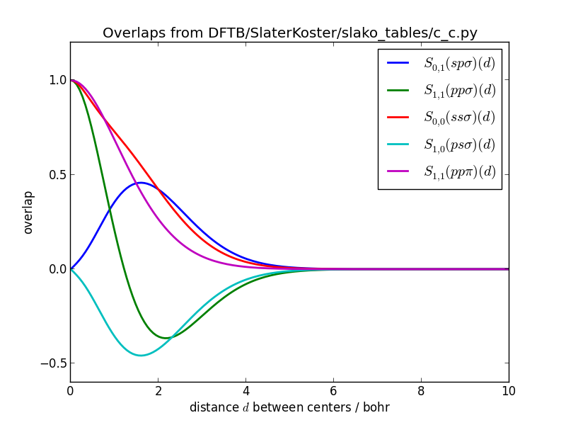
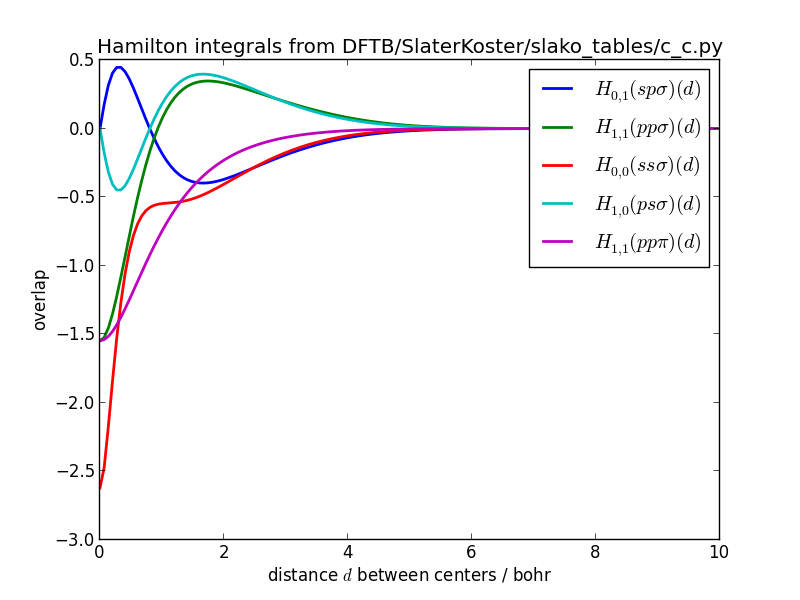

Parametrization
===============

Generation of Pseudo-Atoms
--------------------------
DFTB employs a minimal basis of atomic valence orbitals, which are compressed by a confining potential that mimics the chemical environment. The confinement radius `r_0` is an empirical parameter that influences all subsequent steps in the parametrization. The matrix elements of the electronic Hamiltonian and the overlap are precalculated in the basis of confined orbitals and are stored in the Slater-Koster format, that allows to obtain the matrix element for an arbitrary arrangement of atoms efficiently. However, in a confinement potential most Kohn-Sham eigenvalues will be positive, which is unphysical. In order to find reasonable Kohn-Sham energies, which are the diagonal elements of the Hamiltonian, an atomic DFT calculation is performed for a free atom as well.

The Hubbard parameter `U = IE-EA`, which models the reaction of atoms to partial charges, can be estimated from experimental or theoretical atomic ionization potentials and electron affinities.

The default parameters can be inspected by calling:

~~~bash
python DFTB/Parameters.py
~~~

which produces a list of parameters for the electronic part of DFTB:

~~~
|       DFTB Parameters
|       ===============
|Atom | r0/bohr  | U/hartree
|-----|----------|----------
|  h  |  1.482   |  0.420
|  he |  0.979   |   ---
|  li |  4.475   |  0.175
|  be |  3.356   |   ---
|  b  |  2.937   |  0.295
|  c  |  2.011   |  0.365
|  n  |  2.482   |  0.530
|  o  |  2.307   |  0.447
|  f  |  1.993   |  0.515
|  ne |  2.028   |   ---
|  na |  5.803   |  0.169
|  mg |  4.929   |   ---
|  al |  4.230   |  0.204
|  si |  3.881   |  0.249
|  p  |  3.741   |  0.358
|  s  |  3.671   |  0.304
|  cl |  3.566   |  0.344
~~~

Confined atomic orbitals reside in `DFTB/SlaterKoster/confined_pseudo_atoms/` and can be generated with

~~~bash
python DFTB/SlaterKoster/generate_confined_pseudoatoms.py
~~~

If you need to parametrize a new atom type, you will have to add a section to this program. I will describe how to parametrize the electronic part for silver from scratch (see comments in the code):

~~~python
def silver():
  # Eigenvalues can only be found if they are contained in
  # one of the intervals specified in energy_range.
  # If the approximate positions are known from a previous calculation
  # the search range can be narrowed down and the number of sampling points
  # can be reduced significantly to speed up the calculation.
  energy_range = list(linspace(-1500.0, -800.0, 100)) \
      + list(linspace(-800.0, -200.0, 200)) \
      + list(linspace(-200.0, -30.0, 200)) \
      + list(linspace(-30.0, -5.0, 400)) \
      + list(linspace(-5.0, 5.0, 400)) \

  Z = 47
  Nelec = 47
  # r0 is chosen to be 1.85 times the covalent radius of silver.
  # Settings regarding the confinement and Hubbard parameters
  # can be changed in DFTB/Parameters.py
  atomdft = PseudoAtomDFT(Z,Nelec,numerov_conv,en_conv, grid_spacing="exponential", r0=confinement_radii_byZ[Z], damping=0.6)
  # In silver the 5s is filled before 4f: [Kr] 4d^(10) 5s^1
  occupation = [occ for occ in occupation_numbers(Nelec)]
  assert occupation[-1] == (1,4-1,3)
  occupation[-1] = (1,5-1,0)
  atomdft.setOccupation(occupation)
  # I would like to include unoccupied f orbitals in minimal basis but
  # sofar no Slater rules exist for f orbitals. So include 5p
  atomdft.setValenceOrbitals(["4d", "5s","5p"], format="spectroscopic")
  atomdft.setRadialGrid(0.000000001, 14.0, 20000)
  # The pseudo atomic DFT calculation converges better if an initial
  # guess for the density is provided.
  try:
      # Since I have already calculated silver previously, I try to import
      # this the pseudo atom from a previous calculation.
      from confined_pseudo_atoms import ag
      atomdft.initialDensityGuess((ag.r, ag.radial_density))
      # If there were no density for silver, we could start with the
      # density for copper and scale it so that the integrated density
      # equals the number of electrons in silver:
      #from confined_pseudo_atoms import cu
      #atomdft.initialDensityGuess((cu.r, float(Nelec)/float(cu.Nelec) * cu.radial_density))
  except ImportError:
      # start with zero density
      atomdft.initialDensityGuess()
  atomdft.setEnergyRange(energy_range)
  atomdft.solveKohnSham()
  fh = open(orbdir + "ag.py", "w")
  atomdft.saveSolution(fh)
  fh.close()

# do the calculation
silver()
~~~

Finding the right energy range and converging the calculation can be tricky. For large atoms a correct guess of the initial charge density is important. The safest way to obtain this guess, is to use the converged density of an atom with a lower atomic number, for which a parametrization exists already. In case the Numerov solver for the Kohn Sham equations does not find all orbitals, it can help to change the radial grid or increase the energy range that is searched for Kohn Sham (Shooting Method).

In a similar way, free pseudo atoms are generated, which are stored in `DFTB/SlaterKoster/free_pseudo_atoms/`:

~~~bash
python DFTB/SlaterKoster/generate_free_pseudoatoms.py
~~~

Visual inspection can tell whether the obtained orbitals are reasonable:

~~~bash
python DFTB/SlaterKoster/plot_pseudoatoms.py DFTB/SlaterKoster/confined_pseudo_atoms/c.py
~~~

[[Datei:c_confined_pseudo_atom.png]]

Slater-Koster Integrals
-----------------------
Slater-Koster integrals, from which matrix elements for arbitrary orientations of atoms can be deduced, are calculated on a double-center polar grid. This grid has to be created only once:
~~~bash
python DFTB/SlaterKoster/generate_ptcgrid.py
~~~

Slater-Koster tables, which are stored in `DFTB/SlaterKoster/slako_tables/`, can be generated by:
~~~bash
python DFTB/SlaterKoster/generate_slakotables.py
~~~

If you would want to add silver, for which you have generated pseudo atomic orbitals, you would need to add something like:
~~~python
from confined_pseudo_atoms import h,c,n,o, ag
# silver Ag-X
slako_table(h,ag)
slako_table(c,ag)
slako_table(n,ag)
slako_table(o,ag)
slako_table(ag,ag)
~~~

Note that the first argument to slako_table has to be the atom with lower Z.

The Slater-Koster tables can also be visualized:

~~~bash
python DFTB/SlaterKoster/plot_slakofile.py DFTB/SlaterKoster/slako_tables/c_c.py
~~~

The Slater-Koster integrals should be smooth functions.

Slater-Koster integrals of overlaps for carbon-carbon:

 

Slater-Koster integrals of Hamiltonian for carbon-carbon:

 

Repulsive Potential
-------------------
The repulsive potential is defined as the difference between the DFTB tight-binding potential and the true potential, which is calculated by a higher-level DFT or wavefunction method. It contains the ion-ion repulsion, the interaction between core electrons, contributions from the neglected two-electron integrals and all other exchange and correlation effects that might be absent in DFTB. This said, it seems unlikely that the repulsive potential can be decomposed into a sum of pairwise interactions between atomic centers. Nevertheless, lumping all the missing interactions into an effectively repulsive potential that only acts between pairs of atoms is highly efficient from a computational point of view.

The repulsive potentials for H,C,N and O are taken from Hotbit. There are a few rather limited scripts in `DFTB/RepulsivePotential/` for fitting your own potentials. 
Repulsive potentials from DFTB+ cannot be simply copied because the electronic parametrization seems to be quite different, but you can take the DFTB+ potentials as
a starting point and rescale the potentials, Vrep'(r) = Vrep(S*r), until you obtain the desired bond lengths. For S > 1 the scaled potential Vrep' will become more
repulsive, for S < 1, less repulsive.

To download the DFTB parameter files from [www.dftb.org](http://www.dftb.org/parameters/download/) you are asked to sign a license agreement. Suppose you wish to used the DFTB+ parameters
for silver from the `hyb-0-2` parameter set. 
The following command converts the DFTB+ parameter file `Ag-Ag.skf` to a format that is understood by DFTBaby and makes it a little bit more repulsive:
 
~~~bash
python DFTB/RepulsivePotential/convert_reppotfile.py Ag-Ag.skf DFTB/RepulsivePotential/reppot_tables/ag_ag.py --scaling=1.08
~~~

